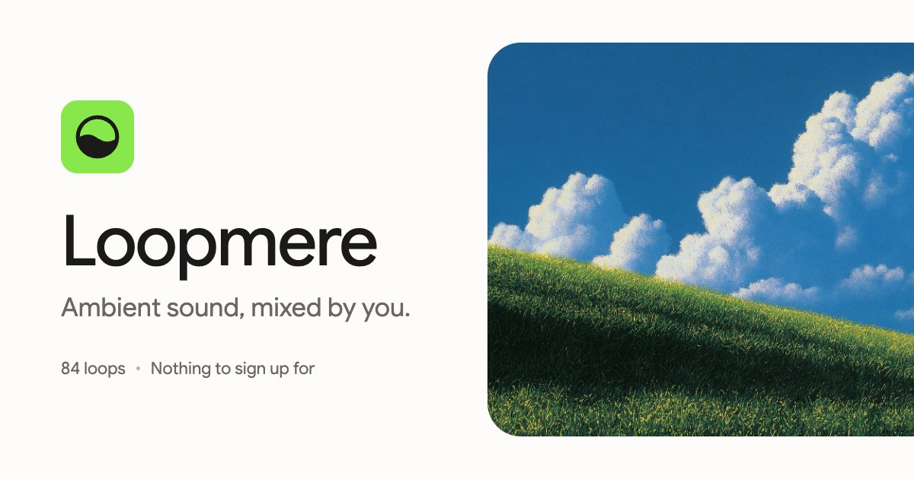

# Loopmere



Ambient sound, mixed by you. Eighty-four loops of rain, forest, cafe and static
that you layer, level and leave running in a tab. There is nothing to sign up
for, and the mix you build stays in your browser.

> **Loopmere is a Next.js port of [Moodist](https://github.com/remvze/moodist)
> by [MAZE](https://github.com/remvze), used under the MIT licence.** The
> sounds, the tools and the architecture are Moodist's. This repository began
> as a Next.js rebuild made to study how it works; it has a face of its own
> now, and a roadmap of what it adds next.
> For the original — maintained, self-hostable, and the reason this exists —
> go to [remvze/moodist](https://github.com/remvze/moodist) or
> [moodist.mvze.net](https://moodist.mvze.net).

## What it does

- 84 loops on eight shelves, each with its own level, plus a shelf of
  favourites you fill yourself
- Presets that remember which loops were on and how loud, and mixes you can
  send as a link
- Tools that run alongside: sleep timer, countdown, Pomodoro, notepad,
  checklist, breathing, binaural beats, isochronic tones and a lofi radio
- Installable as an app, with an offline cache, in light and dark

## What changed in the port

- **Stack:** Astro → Next.js 16 (App Router) with React 19, Base UI, Tailwind
  CSS 4 and zustand.
- **Identity:** a new name and mark. Moodist's name and logo belong to the
  original project, so they appear here only where the original is credited.
- **Fixes found on the way:** lists that doubled on every development reload,
  settings that reset themselves, a share link that sent an empty mix, and
  more. Each one, with its cause, is in [`CONTEXT.md`](CONTEXT.md).

## Roadmap and suggestions

What shipped, what is next and what comes later live in
[`data/roadmap.ts`](data/roadmap.ts) and render at the foot of the home page.
To suggest something or report a fault,
[open an issue](https://github.com/tuanfront-end/loopmere/issues/new/choose):
the forms ask a question or two, and a free GitHub account is all they need.
New sounds come from Moodist, so ask for those on
[its tracker](https://github.com/remvze/moodist/issues).

## Run it

```bash
npm install
npm run dev
```

It serves on [http://localhost:3100](http://localhost:3100) — 3100 rather than
3000 so it can run beside the original, which uses 4321.

```bash
npm run check      # build and the gates that are green today; red here is a regression
npm run check:all  # five more gates; CONTEXT.md § Gate says which are red and why
npm run icons      # re-render the favicon, app icons and media artwork from app/icon.svg
```

Set `NEXT_PUBLIC_SITE_URL` to the deployed address so the canonical URL, the
share cards and the sitemap point at it. On Vercel the production domain is
picked up without it.

## Read first

| File | What it holds |
|---|---|
| [`CONTEXT.md`](CONTEXT.md) | The original's architecture, what the port had to fix, and every deliberate decision since (written in Vietnamese) |
| [`.migration/`](.migration/) | One report per component moved from Radix to Base UI |

## Sound icons

`public/thiings/` is **not in this repository.** The icons come from
[Thiings](https://www.thiings.co), whose free licence covers personal,
non-commercial use with visible credit (the footer carries it) and does not
allow making the files available for download on their own, which is what a
public repository does. The app builds and runs without them: each icon sits
in a fixed-size box with `alt=""`, so a missing file is an empty space rather
than a broken image. To use them, download the files named in
[`data/sound-thiings.ts`](data/sound-thiings.ts) into `public/thiings/`.

A Vercel deployment is built from Git, so it has no `public/thiings/` either.
`npm run build` fetches the files from a private Vercel Blob store first:

1. In the project's **Storage** tab, create a **Blob** store with **Private**
   access and connect it to Production and Preview. Builds on Vercel then
   authenticate on their own.
2. On a machine that has the files, copy `BLOB_READ_WRITE_TOKEN` from the
   store's page into `.env.local`, then run `npm run thiings:push`.
3. Redeploy.

With no store connected the build skips the fetch. With one connected, a file
missing from the store fails the build, so a deployment never goes out with
empty icons.

## Credits and licence

- **Original:** [Moodist](https://github.com/remvze/moodist) by
  [MAZE](https://github.com/remvze) — the product, its sounds, its tools and
  its architecture.
- **Code:** MIT — see [`LICENSE`](LICENSE), Copyright (c) 2023 MAZE.
- **Sounds:** `public/sounds/` (117 MB, committed) under the Pixabay Content
  License and CC0, as in the original.
- **Port:** built by Boolii Studio.

Because `public/sounds/` is committed, a clone is about 125 MB. It runs with
no further download.
